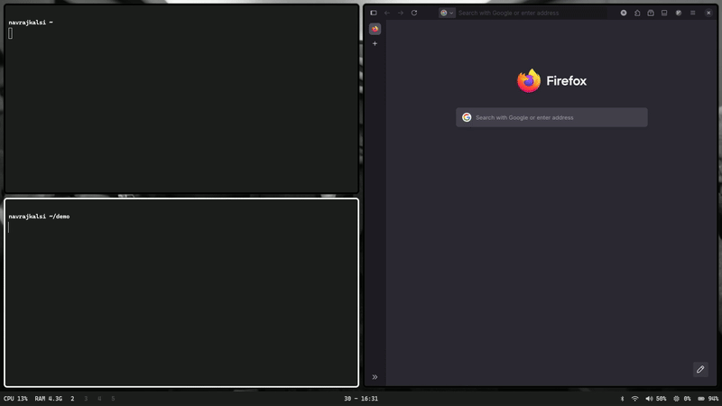

# Proxy-C

<!--  -->

A single-threaded reverse proxy written in C, based on the __reactor pattern__ using __Linux's Epoll__ mechanism.
Full __asynchronous__ state handling, supports HTTPS and canonical name redirection for one host.

<br>

## Motivation

So my last project was a [web server](https://github.com/navrajkalsi/server-c), also made in C.
After making it capable of hosting a real website I rented an AWS instance and tried to host [my own website](https://navrajkalsi.com) with it.

Long story short, just using running my server on port 80 and 443 was not enough.
Google was refusing to index the __HTTPS version__ of my website, even after telling it explicitly with `meta` tags.
So I had to resort an __Nginx proxy__ that redirected all traffic to the HTTPS version of the site.

This is where the idea for a reverse proxy originated, which was in some cases more complex and simpler than __server-c__.

<br>

## Worth-Mentioning Points
* Uses a single `epoll()` instance to monitor all the file descriptors in a true async manner.
* Only supports a __single upstream server__.
* A single upstream removes the need for calling the __blocking__ `getaddrinfo()` function, after accepting.
* Upstream info is loaded even before calling the first `accept()`.
* __Canonical host__ for requests and __upstream__ can be different.
* Redirects with __301__ code, incase canonical host does not match with request header.
* __Regex__ is used to validate the upstream host and host header of every request.
* __TLS__ is used to support __HTTPS__, done using `openssl`.
* __Timeouts__ are used for every individual __I/O__ state.
* A full __connection timeout__ is also used for every connection regardless which state they are in.
* __Custom Error Page__ is served in case of any error, which changes dynamically based on the response status code.
* __Clean Shutdown__ is done by handling interrupt and kill signals.

<br>

## Quick Start

__THIS PROXY SERVER ONLY SUPPORTS LINUX SYSTEMS.__

<details>
<summary>Install Dependencies</summary>

<br>

The following dependencies are required to build and run the program on Linux:
* `gcc`: C Compiler
* `make`: Project build
* `openssl`: TLS handling & HTTPS support

__If using a package manager, please check to see the exact names of these programs for your distro.__
</details>

<details>
<summary>Download the source</summary>

``` bash
git clone https://github.com/navrajkalsi/proxy-c
cd proxy-c
```
</details>

<details>
<summary>Build the project</summary>

#### Common Commands
```bash
# Building
make

# Installing the binary
make install

# Cleaning build objects
make clean

# Uninstall
make uninstall
```

#### Build Options
| __Variable__ | __Default__ | __Description__ |
|:----:|:-----------------:| :---------------------: |
| __DEFAULT_PORT__ | "1419" | Listening port for client side connections. |
| __DEFAULT_CANONCIAL_HOST__ | "https://example.com" | Canonical Host to match the value of `Host` header against. |
| __DEFAULT_UPSTREAM__ | DEFAULT_CANONICAL_HOST | URL of the server to contact for response, if request is deemed valid. |
| __DOMAIN_CERT__ | "/etc/ssl/domain/domain.cert" | Path to domain certificate for HTTPS. |
| __PRIVATE_KEY__ | "/etc/ssl/domain/private.key" | Path to private key for HTTPS. |

<br>

__DOMAIN_CERT & PRIVATE_KEY CAN ONLY BE CHANGED DURING COMPILATION__, i.e., during `make`, and not during runtime with flags.
</details>

## Usage

__If `proxy-c` command is not found after installation, the directory in which the binary got installed is not on the PATH.
ADD THE MAKE INSTALLATION DIRECTORY TO THE PATH AND TRY AGAIN.__

<br>

### Flags

The following __flags__ can be used to alter the behaviour of the program:

| __Flag__ | __Flag Description__| __Required Argument__ | __Default__ |
| :----: | :---------------: | :---------------: | :----: |
|-a| Accept Incoming Connections from all IPs. | | Localhost only |
|-c| Canonical Host to redirect to. | Host origin string | DEFAULT_CANONICAL_HOST |
|-h| Print usage on command line. | | |
|-p| Port to listen on. | Port number | DEFAULT_PORT |
|-s| Use HTTPS for client side. | | HTTP only |
|-S| Use HTTPS for server side. | | HTTP only |
|-u| Server URL to contact for response. | Upstream origin string | DEFAULT_UPSTREAM |
|-v| Print version number. | | |
|-w| Print all warnings as errors. | | Warnings are not printed |

<br>

### Default Usage
```bash
proxy-c
```
By default:
* Loads address information for __DEFAULT_UPSTREAM__.
* Starts listening for clients on __DEFAULT_PORT__.
* Listens to only __localhost__ requests.
* Uses __HTTP__ only for client side operations.
* Matches the host header of each request against __DEFAULT_CANONICAL_HOST__.
* Uses __HTTP__ only for server side operations.

<br>

### Additional Usage Example
```bash
proxy-c -a -c localhost:8080 -p 8080 -S -u https://example.com
```
* Loads address information for __https://example.com__.
* Starts listening for clients on port __8080__.
* Listens to request from _all__ IPs.
* Uses __HTTP__ only for client side operations.
* Matches the host header of each request against __localhost:8080__.
* Uses __HTTPS__ only for server side operations.

<!-- <br> -->

<!-- ### Demo -->
<!--  -->

<!-- <br> -->

<!-- ## Changelog -->
<!-- See [CHANGELOG.md](CHANGELOG.md) for changes made. -->

