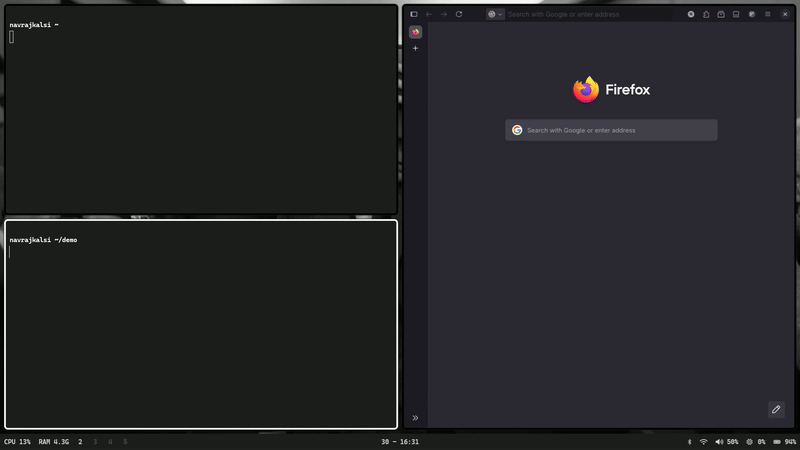

# Proxy-C



A single-threaded reverse proxy written in C, based on the **reactor pattern** using **Linux's Epoll** mechanism.
Full **asynchronous** state handling, supports HTTPS and canonical name redirection for one host.

<br>

## Motivation

So my last project was a [web server](https://github.com/navrajkalsi/server-c), also made in C.
After making it capable of hosting a real website I rented an AWS instance and tried to host [my own website](https://navrajkalsi.com) with it.

Long story short, just using running my server on port 80 and 443 was not enough.
Google was refusing to index the **HTTPS version** of my website, even after telling it explicitly with `meta` tags.
So I had to resort an **Nginx proxy** that redirected all traffic to the HTTPS version of the site.

This is where the idea for a reverse proxy originated, which was in some cases more complex and simpler than **server-c**.

<br>

## Worth-Mentioning Points

- Uses a single `epoll()` instance to monitor all the file descriptors in a true async manner.
- Only supports a **single upstream server**.
- A single upstream removes the need for calling the **blocking** `getaddrinfo()` function, after accepting.
- Upstream info is loaded even before calling the first `accept()`.
- **Canonical host** and **upstream host** can be different.
- Redirects with **301** code, incase canonical host does not match with request header.
- Redirects with **301** code, incase HTTP request is received when using `-s` flag.
- **TLS** is used to support **HTTPS**, done using `openssl`.
- **Timeouts** are used for every individual **I/O** state.
- A full **connection timeout** is also used for every connection regardless which state the
  conneciton is in.
- **Custom Error Page** is served in case of any error, which changes dynamically based on the response status code.
- **Clean Shutdown** is done by handling interrupt and kill signals.

<br>

## Restrictions

- **Backlog** of **25** is allowed for `listen()`, after which requests will be rejected
  automatically.
- **Max number of events** returned by `epoll_wait()` is set to **32**.
- **Max number of active connections** is set to **256**.
- **Buffer size** used for requests and responses is **8192 bytes**.
- **Max size for headers** is also equals to `BUFFER_SIZE`, ie, **8192 bytes**.
- **Max size for chunk header** is set to **18 bytes**, which includes 2 bytes for `CRLF` and rest
  16 bytes for the actual size.
- **Max size of request target** is set to **half of BUFFER_SIZE**, which includes the path along
  with any parameteres or fragments.
- **Max content length** for bodies is set to **10 megabytes**.

<br>

## Limitations

- Only **GET** method is supported for request, rest of the requests receive a **405 Method Not
  Allowed**.
- Only **origin form** is supported for [request
  targets](https://developer.mozilla.org/en-US/docs/Web/HTTP/Guides/Messages#request_targets).
- Only **HTTP/1.0 & HTTP/1.1** are supported, rest of the version receive a **505 HTTP Version Not
  Supported**.
- **Keep-alive header** is not parsed for custom timeout durations, although **keep-alive
  connections** are supported.
- **Request and response bodies** exceeding 10 megabytes are rejected and receive a **413 Content
  Too Large**.
- **Chunked** is the only directive supported for
  [**Transfer-Encoding**](https://developer.mozilla.org/en-US/docs/Web/HTTP/Reference/Headers/Transfer-Encoding),
  other values receive a **501 Not Implemented** response.
- **Extensions** in `chunk headers` is not supported and using those will result in **501 Not Implemented**.

## Quick Start

**THIS PROXY SERVER ONLY SUPPORTS LINUX SYSTEMS.**

<details>
<summary>Install Dependencies</summary>

<br>

The following dependencies are required to build and run the program on Linux:

- `gcc`: C Compiler
- `make`: Project build
- `openssl`: TLS handling & HTTPS support

**If using a package manager, please check to see the exact names of these programs for your distro.**

</details>

<details>
<summary>Download the source</summary>

```bash
git clone https://github.com/navrajkalsi/proxy-c
cd proxy-c
```

</details>

<details>
<summary>Build the project</summary>

#### Common Commands

```bash
# Building
make

# Installing the binary
make install

# Cleaning build objects
make clean

# Uninstall
make uninstall
```

#### Build Options

|        **Variable**        |          **Default**          |                               **Description**                               |
| :------------------------: | :---------------------------: | :-------------------------------------------------------------------------: |
|  **DEFAULT_LISTEN_PORT**   |            "1419"             |                 Listening port for client side connections.                 |
| **DEFAULT_CANONCIAL_HOST** |         "example.com"         |         Canonical Host to match the value of `Host` header against.         |
| **DEFAULT_UPSTREAM_HOST**  |    DEFAULT_CANONICAL_HOST     | Hostname of the server to contact for response, if request is deemed valid. |
|      **DOMAIN_CERT**       | "/etc/ssl/domain/domain.cert" |                    Path to domain certificate for HTTPS.                    |
|      **PRIVATE_KEY**       | "/etc/ssl/domain/private.key" |                       Path to private key for HTTPS.                        |

<br>

**DOMAIN_CERT & PRIVATE_KEY CAN ONLY BE CHANGED DURING COMPILATION**, i.e., during `make`, and not during runtime with flags.

</details>

## Usage

**If `proxy-c` command is not found after installation, the directory in which the binary got installed is not on the PATH.
ADD THE MAKE INSTALLATION DIRECTORY TO THE PATH AND TRY AGAIN.**

<br>

### Flags

The following **flags** can be used to alter the behaviour of the program:

| **Flag** |           **Flag Description**            |      **Required Argument**      |          **Default**          |
| :------: | :---------------------------------------: | :-----------------------------: | :---------------------------: |
|    -a    | Accept Incoming Connections from all IPs. |                                 |        Localhost only         |
|    -c    |      Canonical Host to redirect to.       | Host string, with optional port |    DEFAULT_CANONICAL_HOST     |
|    -h    |       Print usage on command line.        |                                 |                               |
|    -p    |            Port to listen on.             |           Port number           |      DEFAULT_LISTEN_PORT      |
|    -s    |        Use HTTPS for client side.         |                                 | HTTP only (HTTPS is rejected) |
|    -S    |        Use HTTPS for server side.         |                                 |           HTTP only           |
|    -u    |  Upstream Host to contact for response.   | Host string, with optional port |     DEFAULT_UPSTREAM_HOST     |
|    -v    |           Print version number.           |                                 |                               |
|    -w    |       Print all warnings as errors.       |                                 |   Warnings are not printed    |

<br>

### Default Usage

```bash
proxy-c
```

By default:

- Loads address information for **DEFAULT_UPSTREAM_HOST**.
- Starts listening for clients on **DEFAULT_LISTEN_PORT**.
- Listens to only **localhost** requests.
- Uses **HTTP** only for client side operations, rejects **HTTPS** requests.
- Matches the host header of each request against **DEFAULT_CANONICAL_HOST**.
- Uses **HTTP** only for upstream side operations.

<br>

### Additional Usage Example

```bash
proxy-c -a -c localhost:8080 -p 8080 -sS -u example.com
```

- Loads address information for **example.com**.
- Starts listening for clients on port **8080**.
- Listens to request from **all** IPs.
- Uses **HTTPS** for client side operations, upgrades **HTTP** requests with by redirecting with
  **301**.
- Matches the host header of each request against **localhost:8080**.
- Uses **HTTPS** only for server side operations.

<br>

### Demo


<br>

## Changelog

See [CHANGELOG.md](CHANGELOG.md) for changes made.
